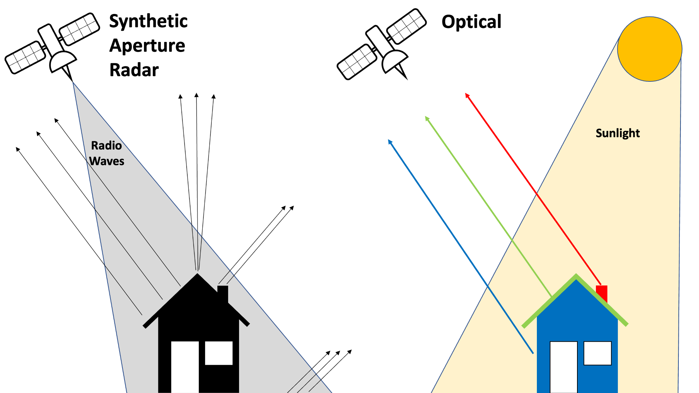
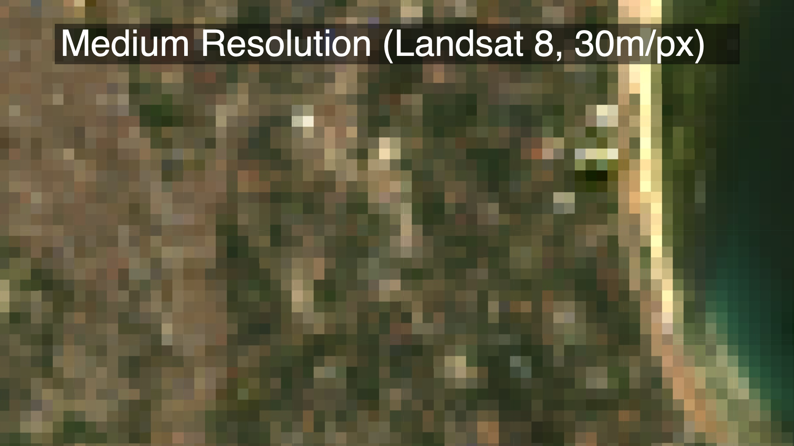
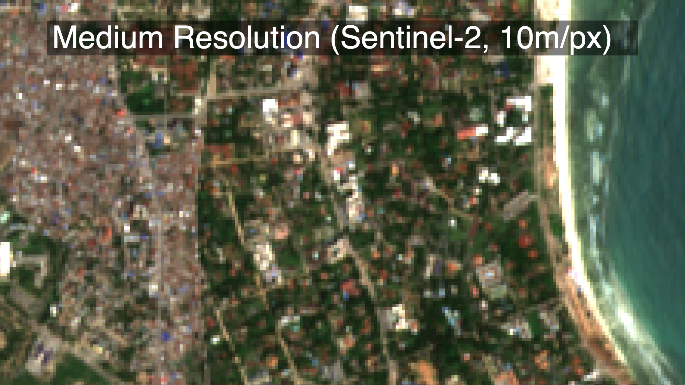
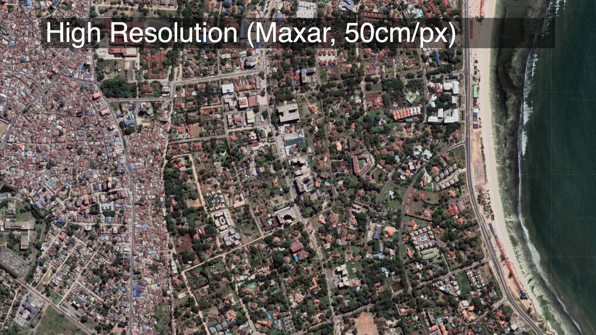
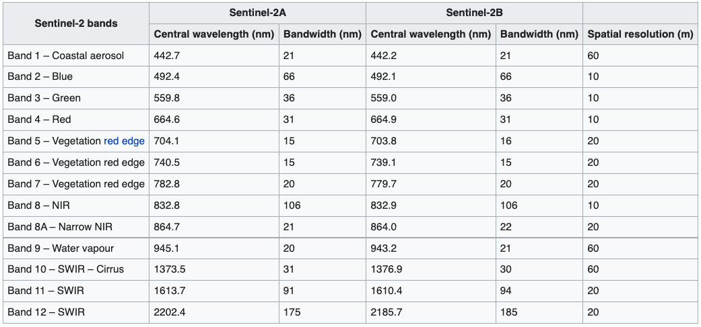
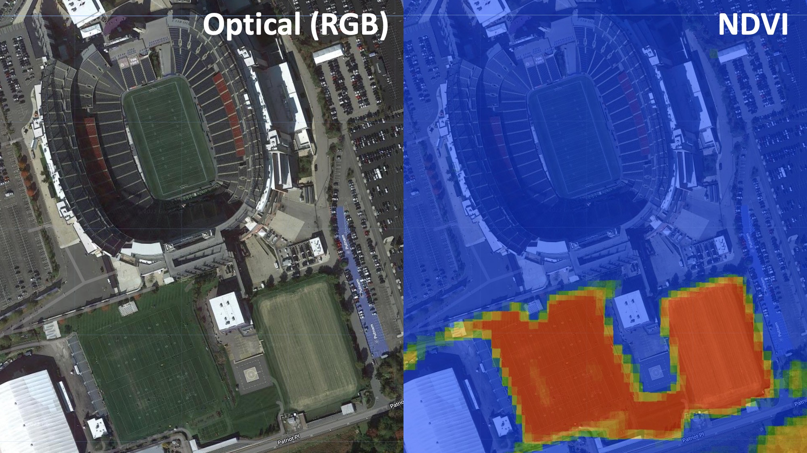
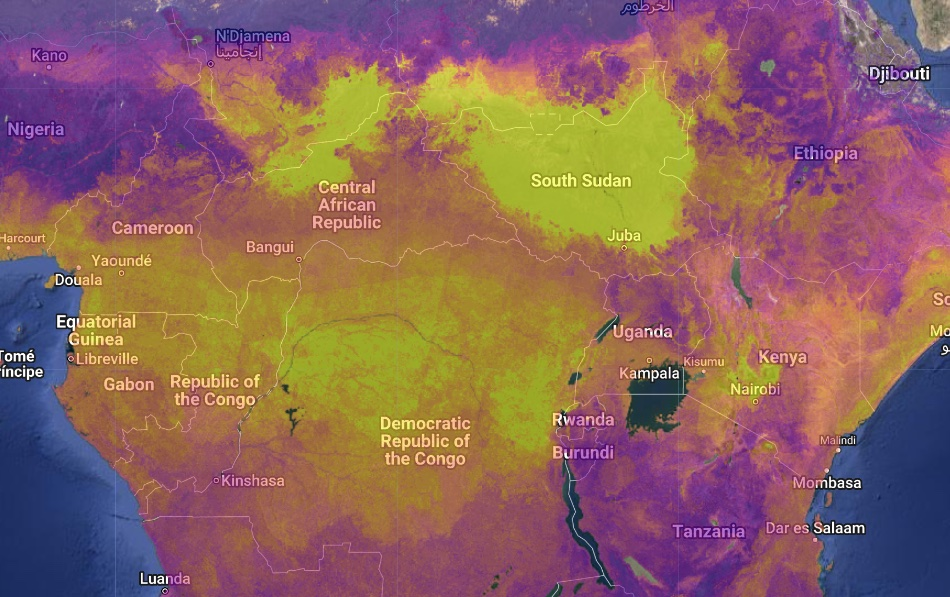
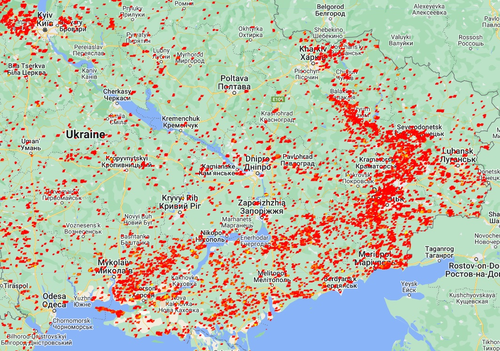
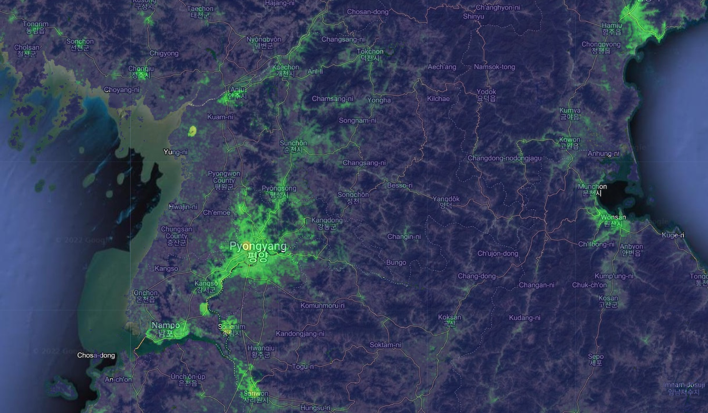
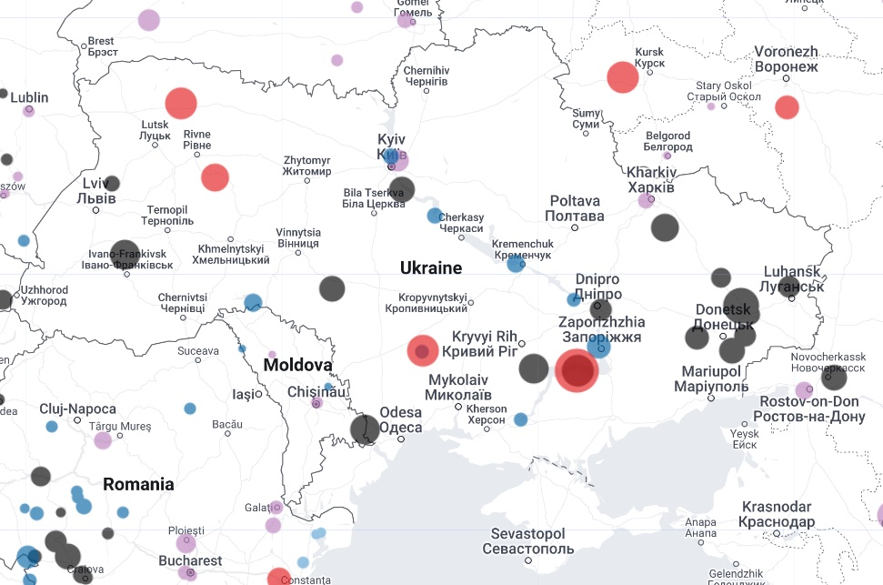

# Remote Sensing

Before learning how to load, process, and analyze satellite imagery in Google Earth Engine, it will be helpful to know a few basic principles of remote sensing. This section provides a brief overview of some important concepts and terminology that will be used throughout the course, including active and passive sensors; spatial, spectral, and temporal resolution; and orbits.

## Active and Passive Sensors

[Remote sensing](https://www.sciencedirect.com/topics/medicine-and-dentistry/remote-sensing) is the science of obtaining information about an object or phenomenon without making physical contact with the object. Remote sensing can be done with various types of electromagnetic radiation such as visible, infrared, or microwave. The electromagnetic radiation is either emitted or reflected from the object being sensed. The reflected radiation is then collected by a sensor and processed to obtain information about the object.

While most satellite imagery is optical, meaning it captures sunlight reflected by the earth’s surface, Synthetic Aperture Radar (SAR) satellites such as Sentinel-1 work by emitting pulses of radio waves and measuring how much of the signal is reflected back. This is similar to the way a bat uses sonar to “see” in the dark: by emitting calls and listening to echoes.

## Resolution

Resolution is one of the most important attributes of satellite imagery. There are three types of resolution: spatial, spectral, and temporal. Let's look at each of these. 

### Spatial Resolution 

Spatial resolution governs how "sharp" an image looks. The Google Maps satellite basemap, for example, is really sharp 
Most of the optical imagery that is freely available has relatively low spatial resolution (it looks more grainy than, for example, the Google satellite basemap), 

### Spectral Resolution 

What open access imagery lacks in spatial resolution it often makes up for with *spectral* resolution. Really sharp imagery from MAXAR, for example, mostly collects light in the visible light spectrum, which is what our eyes can see. But there are other parts of the electromagnetic spectrum that we can't see, but which can be very useful for distinguishing between different materials. Many satellites that have a lower spatial resolution than MAXAR, such as Landsat and Sentinel-2, collect data in a wider range of the electromagnetic spectrum.

Different materials reflect light differently. An apple absorbs shorter wavelengths (e.g. blue and green), and reflects longer wavelengths (red). Our eyes use that information-- the color-- to distinguish between different objects. Below is a plot of the spectral profiles of different materials:

<iframe title="Spectral Profiles of Different Materials" aria-label="Interactive line chart" id="datawrapper-chart-b1kcX" src="https://datawrapper.dwcdn.net/b1kcX/3/" scrolling="no" frameborder="0" style="width: 0; min-width: 100% !important; border: none;" height="400"></iframe>

The visible portion of the spectrum is highlighted on the left, ranging from 400nm (violet) to 700nm (red). Our eyes (and satellite imagery in the visible light spectrum) can only see this portion of the light spectrum; we can't see UV or infrared wavelengths, for example, though the extent to which different materials reflect or absorb these wavelengths is just as useful for distinguishing between them. The European Space Agency's Sentinel-2 satellite collects spectral information well beyond the visible light spectrum, enabling this sort of analysis. It chops the electromagnetic spectrum up into "bands", and measures how strongly wavelengths in each of those bands is reflected:

To illustrate why this is important, consider Astroturf (fake plastic grass). Astroturf and real grass will both look green to us, espeically from a satellite image. But living plants strongly reflect radiation from the sun in a part of the light spectrum that we can't see (near-infrared). There's a spectral index called the Normalized Difference Vegetation Index (NDVI) which exploits this fact to isolate vegetation in multispectral satellite imagery. So if we look at [Gilette Stadium](https://en.wikipedia.org/wiki/Gillette_Stadium) near Boston, we can tell that the three training fields south of the stadium are real grass (they generate high NDVI values, showing up red), while the pitch in the stadium itself is astroturf (generating low NDVI values, showing up blue).

In other words, even though these fields are all green and indistinguishable to the human eye, their *spectral profiles* beyond the visible light spectrum differ, and we can use this information to distinguish between them. 

Astroturf is a trivial example. But suppose we were interested in identifying makeshift oil refineries in Northern Syria that constitute a key source of rents for whichever group controls them. As demonstrated in the ['Refinery Identification'](W07_refineries.qmd) case study, we can train an algorithm to identify the spectral signatures of oil, and use that to automatically detect them in satellite imagery.

### Temporal Resolution 

Finally, the frequency with which we can access new imagery is an important consideration. This is called the **temporal resolution**.

The Google Maps basemap is very high resolution, available globally, and is freely available. But it has no *temporal* dimension: it's a snapshot from one particular point in time. If the thing we're interested in involves *changes* over time, this basemap will be of limited use. 

The **"revisit rate"** is the amount of time it takes for the satellite to pass over the same location twice. For example, the Sentinel-2 constellation's two satellites can achieve a revisit rate of 5 days, as shown in this cool video from the European Space Agency:



Some satellite constellations are able to achieve much higher revisit rates. Sentinel-2 has a revisit rate of 5 days, but SkySat capable of imaging the same point on earth around 12 times per day! How is that possible? Well, as the video above demonstrated, the Sentinel-2 constellation is composed of two satellites that share the same orbit, 180 degrees apart. In contrast, the SkySat constellation comprises 21 satellites, each with its own orbital path: 
 



This allows SkySat to achieve a revisit rate of 2-3 *hours*. The catch, however, is that you need to pay for it (and it [ain't cheap](https://apollomapping.com/blog/an-update-on-skysat-tasking-pricing-and-video-capabilities)). Below is a comparison of revisit rates for various other optical satellites:

](images/revisit_chart.png)

## Summary

You should hopefully have a better understanding of what satellite imagery is, and how it can be used to answer questions about the world. In the next section, we'll look at the various types of satellite imagery stored in the Google Earth Engine catalogue. 

# Data Acquisition

One of the main advantages of GEE is that it hosts several Petabytes of satellite imagery and other spatial data sets, [all in one place](https://developers.google.com/earth-engine/datasets). Among these are a many that could prove useful to those investigating illegal mining and logging, estimating conflict-induced damage, monitoring pollution from extractive industries, conducting maritime surveillance without relying on ship transponders, and many other topics. 

This section highlights ten categories of geospatial data available natively in the GEE catalogue ranging from optical satellite imagery, to atmospheric data, to building footprints. Each sub-section provides an overview of the given data type, suggests potential applications, and lists the corresponding datasets in the GEE catalogue. The datasets listed under each heading are **not** an exhaustive list-- there are over 500 in the whole catalogue, and the ones listed in this section are simply the ones with the most immediate relevance to open source investigations. If a particular geospatial dataset you want to work with isn't hosted in the GEE catalog, you can upload your own data. We'll cover that in the next section. 

## Optical Imagery
 tutorial.](./images/obj_det3.jpg)

Optical satellite imagery is the bread and butter of many open source investiagtions. It would be tough to list off all of the possible use cases, so here's a handy flowchart:

:::{.cell}

:::{.cell-output-display}

:::{}

:::{}

<pre class="mermaid mermaid-js">%%{init: {&#39;theme&#39;: &#39;base&#39;, &#39;themeVariables&#39;: { &#39;primaryColor&#39;: &#39;#FFFFFF&#39; ,&#39;primaryBorderColor&#39;:&#39;#000000&#39; , &#39;lineColor&#39;:&#39;#009933&#39;}}}%%

flowchart
  A(Does it happen outside?) 
  A--&gt; B(Yes)
  A--&gt; C(No)
  D(Is it very small?)
  B--&gt;D
  E(Yes)
  F(No)
    D--&gt;F
    D--&gt;E
G(Use optical satellite imagery)
H(Don&#39;t use optical satellite imagery)
E--&gt;H
F--&gt;G
C--&gt;H
</pre>
:::
:::
:::
:::

This is, of course, a bit of an exaggeration. But if you're interested in a visible phenomenon that happens outdoors and that isn't very tiny, chances are an earth-observing satellite has taken a picture of it. What that picture can tell you naturally depends on what you're interested in learning. For a deeper dive into analyzing optical satellite imagery, see the subsection on [multispectral remote sensing.](ch2.qmd#multispectral-remote-sensing-remote_sensing).

There are several different types of optical satellite imagery available in the GEE catalogue. The main collections are the Landsat and Sentinel series of satellites, which are operated by NASA and the European Space Agency, respectively. Landsat satellites have been in orbit since 1972, and Sentinel satellites have been in orbit since 2015. Norway's International Climate and Forest Initiative (NICFI) has also contributed to the GEE catalogue by providing a collection of optical imagery from Planet's PlanetScope satellites. These are higher resolution (4.7 meters per pixel) than Landsat (30m/px) and Sentinel-2 (10m/px), but are only available for the tropics. Even higher resolution imagery (60cm/px) is available from the GEE catalogue from the National Agriculture Imagery Program, but it is only available for the United States. For more details, see the "Datasets" section below.

### Applications {.unnumbered}

* Geolocating pictures
    - Some of Bellingcat's [earliest work](https://www.bellingcat.com/resources/how-tos/2014/07/09/verification-and-geolocation-tricks-and-tips-with-google-earth/) involved figuring out where a picture was taken by cross-referencing it with optical satellite imagery.
* General surveillance
    - [Monitoring](https://web.archive.org/web/20220415054905/https://fas.org/blogs/security/2021/11/a-closer-look-at-chinas-missile-silo-construction/) Chinese missile silo construction.
    - Amassing [evidence](https://www.nytimes.com/2022/04/04/world/europe/bucha-ukraine-bodies.html) of genocide in Bucha, Ukraine
* Damage detection 
    - [Ukraine](https://www.theguardian.com/world/2022/oct/27/before-and-after-satellite-imagery-will-track-ukraine-cultural-damage-un-says)
    - [Mali](https://reliefweb.int/report/mali/satellite-imagery-conflict-affected-areas-how-technology-can-support-wfp-emergency)
    - [Around the World](https://www.pnas.org/doi/pdf/10.1073/pnas.2025400118)
* Verifying the locations of artillery/missile/drone strikes 
    - The [2019 attack](https://www.cnbc.com/2019/09/17/satellite-photos-show-extent-of-damage-to-saudi-aramco-plants.html) on Saudi Arabia's Abqaiq oil processing facility.
* Monitoring illegal mining/logging
    - Global Witness [investigation](https://www.globalwitness.org/en/campaigns/natural-resource-governance/myanmars-poisoned-mountains/) into illegal mining by militias in Myanmar.
    - Tracking [illegal logging](https://www.theguardian.com/environment/2016/mar/02/new-satellite-mapping-a-game-changer-against-illegal-logging) across the world.

### Datasets {.unnumbered}

| Sensor      | Timeframe    | Resolution | Coverage |
| ----------- | ------------ | ---------- | -------- |
| [Landsat 1-5](https://developers.google.com/earth-engine/datasets/catalog/landsat-mss) | 1972–1999    | 30m        | Global   |
| [Landsat 7](https://developers.google.com/earth-engine/datasets/catalog/LANDSAT_LE07_C02_T1_L2)   | 1999–2021    | 30m        | Global   |
| [Landsat 8](https://developers.google.com/earth-engine/datasets/catalog/LANDSAT_LC08_C02_T1_L2)   | 2013–Present | 30m        | Global   |
| [Landsat 9](https://developers.google.com/earth-engine/datasets/catalog/LANDSAT_LC09_C02_T1_L2)   | 2021–Present | 30m        | Global   |
| [Sentinel-2](https://developers.google.com/earth-engine/datasets/catalog/COPERNICUS_S2_SR_HARMONIZED)  | 2015–Present | 10m        | Global   |
| [NICFI](https://developers.google.com/earth-engine/datasets/tags/nicfi)       | 2015-Present | 4.7m       | Tropics  |
| [NAIP](https://developers.google.com/earth-engine/datasets/catalog/USDA_NAIP_DOQQ)        | 2002-2021    | 0.6m       | USA      |

## Radar Imagery 

Synthetic Aperture Radar imagery (SAR) is a type of remote sensing that uses radio waves to detect objects on the ground. SAR imagery is useful for detecting objects that are small, or that are obscured by clouds or other weather phenomena. SAR imagery is also useful for detecting objects that are moving, such as ships or cars. 

### Applications {.unnumbered}

* Change/Damage detection 
* Tracking military radar systems
* Maritime surveillance
* Monitoring illegal mining/logging

### Datasets {.unnumbered}

| Sensor      | Timeframe    | Resolution | Coverage |
| ----------- | ------------ | ---------- | -------- |
| [Sentinel 1](https://developers.google.com/earth-engine/datasets/catalog/COPERNICUS_S1_GRD) | 2014-Present    | 10m        | Global   |

## Nighttime Lights 

Satellite images of the Earth at night a useful proxy for human activity. The brightness of a given area at night is a function of the number of people living there and the nature of their activities. The effects of conflict, natural disasters, and economic development can all be inferred from changes in nighttime lights. 

The timelapse above reveals a number of interesting things: The capture of Mosul by ISIS in 2014 and the destruction of its infrastructure during the fighting (shown as the city darkening), as well as the liberation of the city by the Iraqi military in 2017 are all visible in nighttime lights. The code to create this gif, as well as a more in-depth tutorial on the uses of nighttime lights, can be found in the ["War at Night"](lights.qmd) case study.

### Applications {.unnumbered}

* Damage detection 
* Identifying gas flaring/oil production
* Identifying urban areas/military bases illuminated at night 

### Datasets {.unnumbered}

| Sensor      | Timeframe    | Resolution | Coverage |
| ----------- | ------------ | ---------- | -------- |
| [DMSP-OLS](https://developers.google.com/earth-engine/datasets/catalog/NOAA_DMSP-OLS_NIGHTTIME_LIGHTS) | 1992-2014    | 927m        | Global   |
| [VIIRS](https://developers.google.com/earth-engine/datasets/catalog/NOAA_VIIRS_DNB_MONTHLY_V1_VCMSLCFG)   | 2014-Present    | 463m        | Global   |

## Climate and Atmospheric Data

{width=100%}

Climate and atmospheric data can be used to track the effects of conflict on the environment. The European Space Agency's Sentinel-5p satellites measure the concentration of a number of atmospheric gases, including nitrogen dioxide, methane, and ozone. Measurements are available on a daily basis at a fairly high resolution (1km), allowing for the detection of localized sources of pollution such as oil refineries or power plants. For example, see this [Bellingcat article](https://www.bellingcat.com/resources/2021/04/15/what-oil-satellite-technology-and-iraq-can-tell-us-about-pollution/) in which Wim Zwijnenburg and I trace pollution to specific facilities operated by multinational oil companies in Iraq.

The Copernicus Atmosphere Monitoring Service (CAMS) provides similar data at a lower spatial resolution (45km), but measurements are avaialble on an hourly basis. The timelapse above utilizes CAMS data to show a sulphur dioxide plume resulting from an ISIS attack on the Al-Mishraq Sulphur Plant in Iraq. The plant was used to produce sulphuric acid, for use in fertilizers and pesticides. The attack destroyed the plant, causing a fire which burned for a month and released [21 kilotons](https://earthobservatory.nasa.gov/images/88994/sulfur-dioxide-spreads-over-iraq) of sulphur dioxide into the atmosphere per day; the largest human-made release of sulphur dioxide in history. 

### Applications {.unnumbered}

* Monitoring of airborne pollution 
* Tracing pollution back to specific facilities and companies 
* Visualizing the effects of one-off environmental catastrophes 
    - Nordstream 1 leak
    - ISIS setting Mishraq sulphur plant on fire 

### Datasets {.unnumbered}

| Sensor      | Timeframe    | Resolution | Coverage |
| ----------- | ------------ | ---------- | -------- |
| [CAMS NRT](https://developers.google.com/earth-engine/datasets/catalog/ECMWF_CAMS_NRT) | 2016-Present    | 44528m        | Global   |
| [Sentinel-5p](https://developers.google.com/earth-engine/datasets/catalog/sentinel-5p)   | 2018-Present    | 1113m        | Global   |

## Mineral Deposits

Mining activities often play an important role in conflict. According to an influential [study](https://www.aeaweb.org/articles?id=10.1257/aer.20150774), "the historical rise in mineral prices might explain up to one-fourth of the average level of violence across African countries" between 1997 and 2010. Data on the location of mineral deposits can be used to identify areas where mining activities are likely to be taking place, and several such datasets are available in Google Earth Engine.

### Applications {.unnumbered}

* Monitoring mining activity
* Identifying areas where mining activities are likely to be taking place
* Mapping the distribution of resources in rebel held areas in conflicts fueled by resource extraction

### Datasets {.unnumbered}

| Sensor      | Timeframe    | Resolution | Coverage |
| ----------- | ------------ | ---------- | -------- |
| [iSDA](https://developers.google.com/earth-engine/datasets/tags/isda) | 2001-2017    | 30m        | Africa   |

## Fires

Earth-observing satellites can detect "thermal anomalies" (fires) from space. NASA's Fire Information for Resource Management System (FIRMS) provides daily data on active fires in near real time, going back to the year 2000. Carlos Gonzales wrote a comprehensive [Bellingcat article](https://www.bellingcat.com/resources/2022/10/04/scorched-earth-using-nasa-fire-data-to-monitor-war-zones/) on the use of FIRMS to monitor war zones from Ukraine to Ethiopia. The map above shows that FIRMS detected fires over Eastern Ukraine trace the frontline of the war. 

FIRMS data are derived from the MODIS satellite, but only show the central location and intensity of a detected fire. Another MODIS product (linked in the table below) generates a monthly map of burned areas, which can be used to assess the spatial extent of fires. 

### Applications {.unnumbered}
* Identification of possible artillery strikes/fighting in places like Ukraine 
* Environmental warfare and "scorched earth" policies
* Large scale arson
    - e.g. [Refugee camps burned down in Myanmar](https://citizenevidence.org/2021/02/26/using-viirs-fire-data-for-human-rights-research/)

### Datasets {.unnumbered}

| Sensor      | Timeframe    | Resolution | Coverage |
| ----------- | ------------ | ---------- | -------- |
| [FIRMS](https://developers.google.com/earth-engine/datasets/catalog/FIRMS)  |2000-Present     |  1000m        | Global   |
| [MODIS Burned Area](https://developers.google.com/earth-engine/datasets/catalog/CIESIN_GPWv411_GPW_Population_Count)  | 2000-Present    | 500m        | Global   |

## Population Density Estimates

Sometimes, we may want to get an estimate the population in a specific area to ballpark how many people might be affected by a natural disaster, a counteroffensive, or a missile strike. You can't really google "what is the population in this rectangle i've drawn in Northeastern Syria?" and get a good answer. Luckily, there are several spatial population datasets hosted in GEE that let you do just that. Some, such as WorldPop, provide estimated breakdowns by age and sex as well. However, it is extremely important to bear in mind that these are **estimates**, and will **not** take into account things like conflict-induced displacement. For example, Oak Ridge National Laboratory's LandScan program has released high-resolution population data for Ukraine, but this pertains to the pre-war population distribution. The war has radically changed this distribution, so these estimates no longer reflect where people *are*. Still, this dataset could be used to roughly estimate displacement or the number of people who will need new housing. 

### Applications: {.unnumbered}

* Rough estimates of civilians at risk from conflict or disaster, provided at a high spatial resolution 

### Datasets {.unnumbered}

| Sensor      | Timeframe    | Resolution | Coverage |
| ----------- | ------------ | ---------- | -------- |
| [Worldpop](https://developers.google.com/earth-engine/datasets/tags/worldpop)  |2000-2021     |  92m        | Global   |
| [GPW](https://developers.google.com/earth-engine/datasets/catalog/CIESIN_GPWv411_GPW_Population_Count)  | 2000-2021    | 927m        | Global   |
| [LandScan](https://developers.google.com/earth-engine/datasets/catalog/DOE_ORNL_LandScan_HD_Ukraine_202201)   | 2013–Present | 100m        | Ukraine   |

## Building Footprints 

A building footprint dataset contains the two dimensional outlines of buildings in a given area. Currently, GEE hosts one building footprint dataset which covers all of Africa. In 2022, Microsoft released a free [global building footprint dataset](https://www.microsoft.com/en-us/maps/building-footprints), though to use it in Earth Engine you'll have to download it from their [GitHub page](https://github.com/Microsoft/USBuildingFootprints) and upload it manually to GEE. The same goes for OpenStreetMap (OSM), a public database of building footprints, roads, and other features that also contains useful annotations for many buildings indicating their use. [Benjamin Strick](https://www.youtube.com/watch?v=bJkV3l5Haq0) has a great youtube video on conducting investigations using OSM data.

### Applications: {.unnumbered}

* Joining damage estimate data with the number of buildings in an area

### Datasets {.unnumbered}

| Dataset      | Timeframe    | Coverage |
| ----------- | ------------ | -------- |
| [Open Buildings](https://developers.google.com/earth-engine/datasets/catalog/GOOGLE_Research_open-buildings_v2_polygons)  |2022   | Africa   |

## Administrative Boundaries 

Spatial analysis often have to aggregate information over a defined area; we may want to assess the total burned area by province in Ukraine, or count the number of Saudi airstrikes by district in Yemen. For that, we need data on these administrative boundaries. GEE hosts several such datasets at the country, province, and district (or equivalent) level. 

### Applications {.unnumbered}

* Quick spatial calculations for different provinces/districts in a country
    - e.g. counts of conflict events by district over time

### Datasets {.unnumbered}

| Dataset      | Timeframe    | Coverage |
| ----------- | ------------ | -------- |
| [FAO GAUL](https://developers.google.com/earth-engine/datasets/tags/gaul)  |2015   | Global   |

## Global Power Plant Database

The Global Power Plant Database is a comprehensive, open source database of power plants around the world. It centralizes power plant data to make it easier to navigate, compare and draw insights. Each power plant is geolocated and entries contain information on plant capacity, generation, ownership, and fuel type. As of June 2018, the database includes around 28,500 power plants from 164 countries. The database is curated by the [World Resources Institude (WRI)](https://datasets.wri.org/dataset/globalpowerplantdatabase).

### Applications: {.unnumbered}

* Analyzing the impact of conflict on critical infrastructure.
    - e.g. fighting in Ukraine taking place around nuclear power facilities. 
* Could be combined with the atmospheric measurements of different pollutants and the population estimates data to assess the impact of various forms of energy generation on air quality and public health. 

### Datasets {.unnumbered}

| Dataset      | Timeframe    | Coverage |
| ----------- | ------------ | -------- |
| [GPPD](https://developers.google.com/earth-engine/datasets/catalog/WRI_GPPD_power_plants)  |2018   | Global   |
