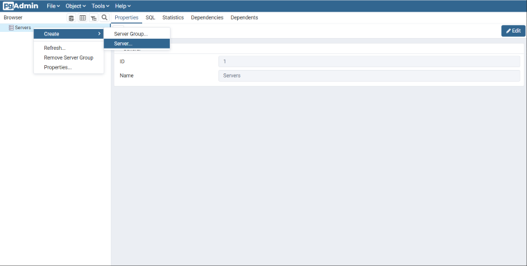
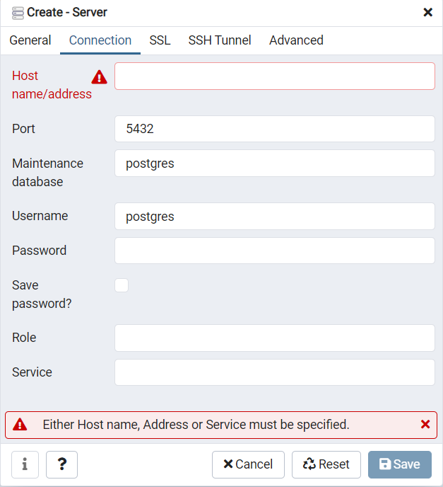
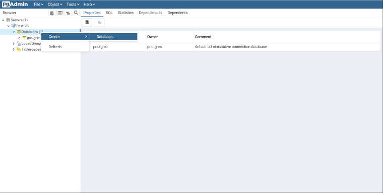
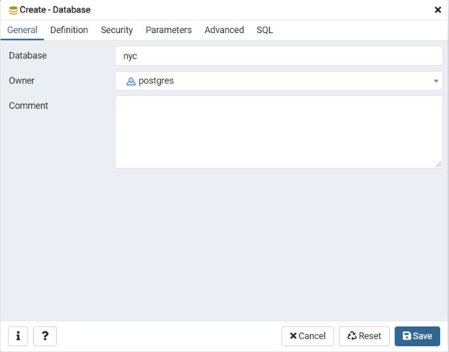

# PgAdmin

PostgreSQL has a number of administrative front-ends. The primary one is
[psql](http://www.postgresql.org/docs/current/static/app-psql.html), a
command-line tool for entering SQL queries. Another popular PostgreSQL
front-end is the free and open source graphical tool
[pgAdmin](http://www.pgadmin.org/). All queries done in pgAdmin can also
be done on the command line with `psql`. pgAdmin also includes a
geometry viewer you can use to spatial view PostGIS queries.

1.  Find pgAdmin and start it up.

    {.inline .inline}

2.  If this is the first time you have run pgAdmin, you probably don\'t
    have any servers configured. Right click the `Servers` item in the
    Browser panel.

    We\'ll name our server **PostGIS**. In the Connection tab, enter the
    `Host name/address`. If you\'re working with a local PostgreSQL
    install, you\'ll be able to use `localhost`. If you\'re using a
    cloud service, you should be able to retrieve the host name from
    your account.

    Leave **Port** set at `5432`, and both **Maintenance database** and
    **Username** as `postgres`. The **Password** should be what you
    specified with a local install or with your cloud service.

    {.inline .inline}

# Creating a Database

1.  Open the Databases tree item and have a look at the available
    databases. The `postgres` database is the user database for the
    default postgres user and is not too interesting to us.

2.  Right-click on the `Databases` item and select `New Database`.

    {.inline .inline}

3.  Fill in the `Create Database` form as shown below and click **OK**.

      ----------- ------------
      **Name**    `nyc`
      **Owner**   `postgres`
      ----------- ------------

    {.inline .inline}

4.  Select the new `nyc` database and open it up to display the tree of
    objects. You\'ll see the `public` schema.

    

5.  Click on the SQL query button indicated below (or go to *Tools \>
    Query Tool*).

    

6.  Enter the following query into the query text field to load the
    PostGIS spatial extension:

    ``` sql
    CREATE EXTENSION postgis;
    ```

7.  Click the **Play** button in the toolbar (or press **F5**) to
    \"Execute the query.\"

8.  Now confirm that PostGIS is installed by running a PostGIS function:

    ``` sql
    SELECT postgis_full_version();
    ```

You have successfully created a PostGIS spatial database!!

# Function List

[PostGIS_Full_Version](http://postgis.net/docs/PostGIS_Full_Version.html):
Reports full PostGIS version and build configuration info.
