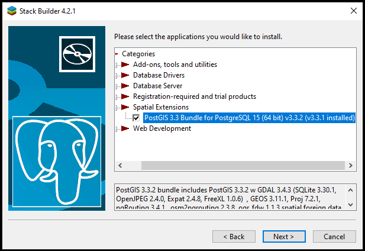
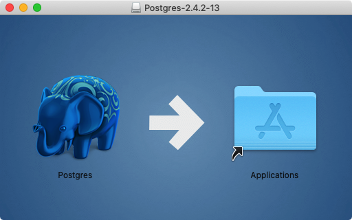
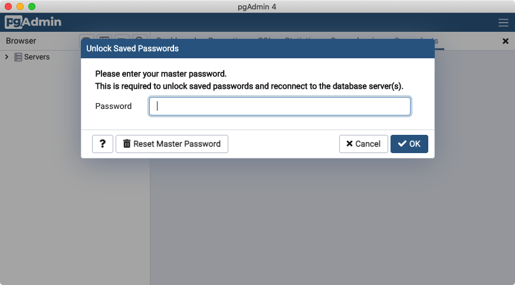

To explore the PostgreSQL/PostGIS database, and learn about writing
spatial queries in SQL, we will need some software, either installed
locally or available remotely on the cloud.

-   There are instructions below on how to access PostgreSQL for
    installation on Windows or MacOS. PostgreSQL for Windows and MacOS
    either include PostGIS or have an easy way to add it on.
-   There are instructions below on how to install
    [PgAdmin](https://www.pgadmin.org/). PgAdmin is a graphical database
    explorer and SQL editor which provides a \"user facing\" interface
    to the database engine that does all the world.

For always up-to-date directions on installing PostgreSQL, go to the
[PostgreSQL download page](https://www.postgresql.org/download/) and
select the operating system you are using.

# PostgreSQL for Microsoft Windows

For a Windows install:

1.  Go to the [Windows PostgreSQL download
    page](https://www.enterprisedb.com/downloads/postgres-postgresql-downloads).

2.  Select the latest version of PostgreSQL and save the installer to
    disk.

3.  Run the installer and accept the defaults.

4.  Find and run the \"StackBuilder\" program that was installed with
    the database.

5.  Select the \"Spatial Extensions\" section and choose latest
    \"PostGIS ..Bundle\" option.

    {.inline .inline}

6.  Accept the defaults and install.

# PostgreSQL for Apple MacOS

For a MacOS install:

1.  Go to the [Postgres.app](https://postgresapp.com/) site, and
    download the latest release.

2.  Open the disk image, and drag the **Postgres** icon into the
    **Applications** folder.

    {.inline .inline}

3.  In the **Applications** folder, double-click the **Postgres** icon
    to start the server.

4.  Click the **Initialize** button to create a new blank database
    instance.

    {.inline, .border
    .inline, .border}

5.  In the **Applications** folder, go to the **Utilities** folder and
    open **Terminal**.

6.  Add the command-line utilities to your [PATH]{.title-ref} for
    convenience.

>     sudo mkdir -p /etc/paths.d
>     echo /Applications/Postgres.app/Contents/Versions/latest/bin | sudo tee /etc/paths.d/postgresapp

# PgAdmin for Windows and MacOS

PgAdmin is available for multiple platforms, at
<https://www.pgadmin.org/download/>.

1.  Download and install the latest version for your platform.

2.  Start PgAdmin!

    {.inline .inline}
