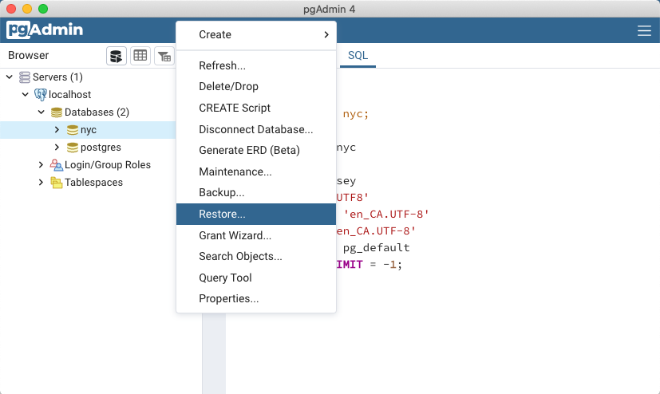
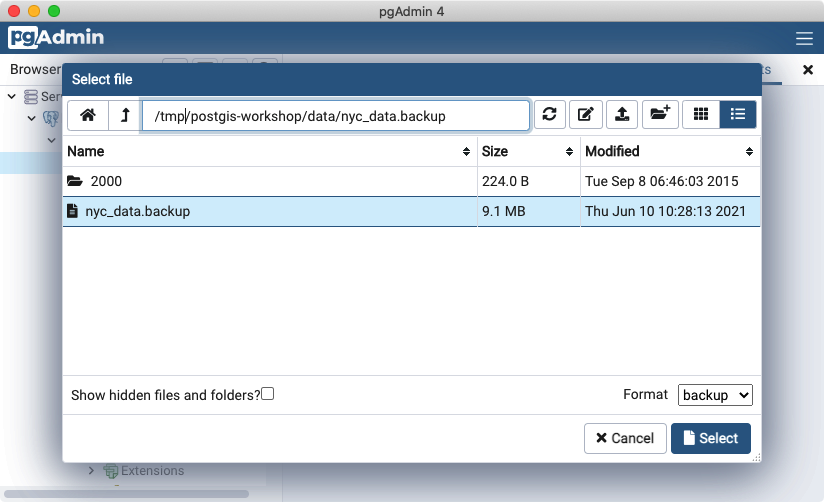
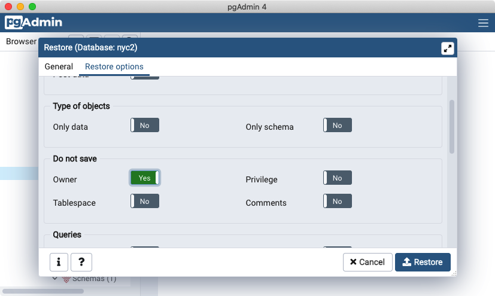
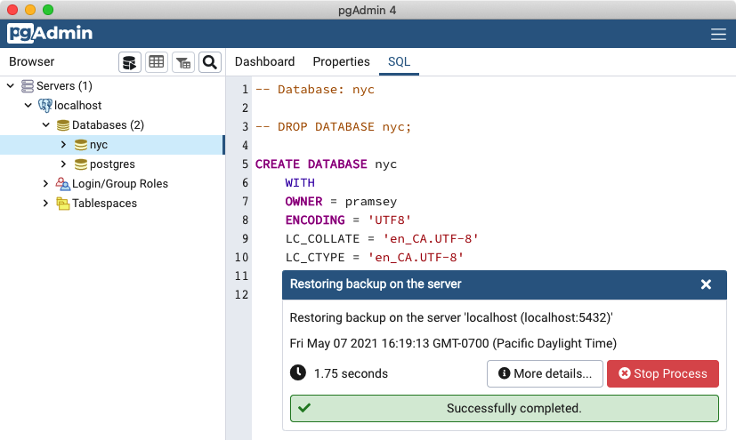
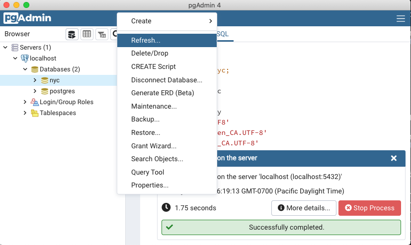
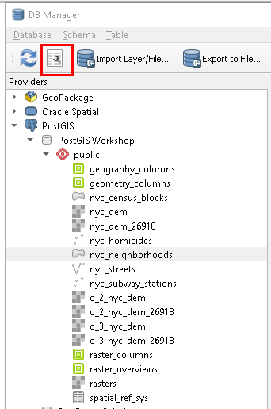

Supported by a wide variety of libraries and applications, PostGIS
provides many options for loading data.

We will first load our working data from a database backup file, then
review some standard ways of loading different GIS data formats using
common tools.

# Loading the Backup File

1.  In the PgAdmin browser, **right-click** on the **nyc** database
    icon, and then select the **Restore\...** option.

    {.inline, .border .inline,
    .border}

2.  Browse to the location of your workshop data data directory
    (available in the workshop [data
    bundle](https://s3.amazonaws.com/s3.cleverelephant.ca/postgis-workshop-2020.zip)),
    and select the `nyc_data.backup`{.interpreted-text role="file"}
    file.

    {.inline, .border .inline,
    .border}

3.  Click on the **Restore options** tab, scroll down to the **Do not
    save** section and toggle **Owner** to **Yes**.

    {.inline, .border
    .inline, .border}

4.  Click the **Restore** button. The database restore should run to
    completion without errors.

    {.inline, .border .inline,
    .border}

5.  After the load is complete, right click the **nyc** database, and
    select the **Refresh** option to update the client information about
    what tables exist in the database.

    {.inline, .border .inline,
    .border}

::: note
::: title
Note
:::

If you want to practice loading data from the native spatial formats,
instead of using the PostgreSQL db backup files just covered, the next
couple of sections will guide you thru loading using various
command-line tools and QGIS DbManager. Note you can skip these sections,
if you have already loaded the data with pgAdmin.
:::

# Loading with ogr2ogr

`ogr2ogr`{.interpreted-text role="file"} is a commandline utility for
converting data between GIS data formats, including common file formats
and common spatial databases.

**Windows**:

:   -   Builds of ogr2ogr can be downloaded from [GIS
        Internals](https://www.gisinternals.com/release.php).
    -   ogr2ogr is included as part of [QGIS
        Install](https://qgis.org/en/site/forusers/download.html) and
        accessible via OSGeo4W Shell -
    -   Builds of ogr2ogr can be downloaded from
        [MS4W](https://ms4w.com/download.html).

**MacOS**:

:   -   If you installed [Postgres.app](https://postgresapp.com/), then
        you will find `ogr2ogr`{.interpreted-text role="file"} in the
        `/Applications/Postgres.app/Contents/Versions/*/bin`{.interpreted-text
        role="file"} directory.
    -   Finally, if you have installed [HomeBrew](https://brew.sh/) you
        can install the **gdal** package to get access to
        `ogr2ogr`{.interpreted-text role="file"}

**Linux**:

:   -   If you installed QGIS from packages, `ogr2ogr`{.interpreted-text
        role="file"} should be installed and on your PATH already as
        part of the **gdal** or *libgdal*\* packages.

The postgis workshop data directory includes a `2000/`{.interpreted-text
role="file"} sub-directory, which contains shape files from the 2000
census, that were obsoleted by data from the 2010 census. We can
practice data loading using those files, to avoid creating name
collisions with the data we already loaded using the backup file. Be
sure to be in the `2000/`{.interpreted-text role="file"} sub-directory
with the shell when doing these instructions:

    export PGPASSWORD=mydatabasepassword

Rather than passing the password in the connection string, we put it in
the environment, so it won\'t be visible in the process list while the
command runs.

Note that on Windows, you will need to use `set` instead of `export`.

:

    ogr2ogr \
      -nln nyc_census_blocks_2000 \
      -nlt PROMOTE_TO_MULTI \
      -lco GEOMETRY_NAME=geom \
      -lco FID=gid \
      -lco PRECISION=NO \
      Pg:"dbname=nyc host=localhost user=pramsey port=5432" \
      nyc_census_blocks_2000.shp

For more visual clarity, these lines are displayed with `\`, but they
should be written in one line on your shell.

The `ogr2ogr`{.interpreted-text role="file"} has a **huge** number of
options, and we\'re only using a handful of them here. Here is a
line-by-line explanation of the command.

    ogr2ogr \

The executable name! You may need to ensure the executable location is
in your [PATH]{.title-ref} or use the full path to the executable,
depending on your setup.

    -nln nyc_census_blocks_2000 \

The **nln** option stands for \"new layer name\", and sets the table
name that will be created in the target database.

    -nlt PROMOTE_TO_MULTI \

The **nlt** option stands for \"new layer type\". For shape file input
in particular, the new layer type is often a \"multi-part geometry\", so
the system needs to be told in advance to use \"MultiPolygon\" instead
of \"Polygon\" for the geometry type.

    -lco GEOMETRY_NAME=geom \
    -lco FID=gid \
    -lco PRECISION=NO \

The **lco** option stands for \"layer create option\". Different drivers
have different create options, and we are using three options for the
[PostgreSQL driver](https://gdal.org/drivers/vector/pg.html) here.

-   **GEOMETRY_NAME** sets the column name for the geometry column. We
    prefer \"geom\" over the default, so that our tables match the
    standard column names in the workshop.
-   **FID** sets the primary key column name. Again we prefer \"gid\"
    which is the standard used in the workshop.
-   **PRECISION** controls how numeric fields are represented in the
    database. The default when loading a shape file is to use the
    database \"numeric\" type, which is more precise but sometimes
    harder to work with than simple number types like \"integer\" and
    \"double precision\". We use \"NO\" to turn off the \"numeric\"
    type.

```{=html}
<!-- -->
```
    Pg:"dbname=nyc host=localhost user=pramsey port=5432" \

The order of arguments in `ogr2ogr`{.interpreted-text role="file"} is,
roughly: executable, then options, then **destination** location, then
**source location**. So this is the destination, the connection string
for our PostgreSQL database. The \"Pg:\" portion is the driver name, and
then the [connection
string](https://www.postgresql.org/docs/current/libpq-connect.html#LIBPQ-CONNSTRING)
is contained in quotation marks (because it might have embedded spaces).

    nyc_census_blocks_2000.shp

The source data set in this case is the shape file we are reading. It is
possible to read multiple layers in one invocation by putting the
connection string here, and then following it with a list of layer
names, but in this case we have just the one shape file to load.

# Shapefiles? What\'s that?

You may be asking yourself \-- \"What\'s this shapefile thing?\" A
\"shapefile\" commonly refers to a collection of files with `.shp`,
`.shx`, `.dbf`, and other extensions on a common prefix name (e.g.,
nyc_census_blocks). The actual shapefile relates specifically to files
with the `.shp` extension. However, the `.shp` file alone is incomplete
for distribution without the required supporting files.

Mandatory files:

-   `.shp`---shape format; the feature geometry itself
-   `.shx`---shape index format; a positional index of the feature
    geometry
-   `.dbf`---attribute format; columnar attributes for each shape, in
    dBase III

Optional files include:

-   `.prj`---projection format; the coordinate system and projection
    information, a plain text file describing the projection using
    well-known text format

The `shp2pgsql`{.interpreted-text role="file"} utility makes shape data
usable in PostGIS by converting it from binary data into a series of SQL
commands that are then run in the database to load the data.

# Loading with shp2pgsql

The `shp2pgsql`{.interpreted-text role="file"} converts Shape files into
SQL. It is a conversion utility that is part of the PostGIS code base
and ships with PostGIS packages. If you installed PostgreSQL locally on
your computer, you may find that `shp2pgsql`{.interpreted-text
role="file"} has been installed along with it, and it is available in
the executable directory of your installation.

Unlike `ogr2ogr`{.interpreted-text role="file"},
`shp2pgsql`{.interpreted-text role="file"} does not connect directly to
the destination database, it just emits the SQL equivalent to the input
shape file. It is up to the user to pass the SQL to the database, either
with a \"pipe\" or by saving the SQL to file and then loading it.

Here is an example invocation, loading the same data as before:

    export PGPASSWORD=mydatabasepassword

    shp2pgsql \
      -D \
      -I \
      -s 26918 \
      nyc_census_blocks_2000.shp \
      nyc_census_blocks_2000 \
      | psql dbname=nyc user=postgres host=localhost

Here is a line-by-line explanation of the command.

    shp2pgsql \

The executable program! It reads the source data file, and emits SQL
which can be directed to a file or piped to `psql`{.interpreted-text
role="file"} to load directly into the database.

    -D \

The **D** flag tells the program to generate \"dump format\" which is
much faster to load than the default \"insert format\".

    -I \

The **I** flag tells the program to create a spatial index on the table
after loading is complete.

    -s 26918 \

The **s** flag tells the program what the \"spatial reference identifier
(SRID)\" of the data is. The source data for this workshop is all in
\"UTM 18\", for which the SRID is **26918** (see below).

    nyc_census_blocks_2000.shp \

The source shape file to read.

    nyc_census_blocks_2000 \

The table name to use when creating the destination table.

    | psql dbname=nyc user=postgres host=localhost

The utility program is generating a stream of SQL. The \"\|\" operator
takes that stream and uses it as input to the `psql`{.interpreted-text
role="file"} database terminal program. The arguments to
`psql`{.interpreted-text role="file"} are just the connection string for
the destination database.

# SRID 26918? What\'s with that?

Most of the import process is self-explanatory, but even experienced GIS
professionals can trip over an **SRID**.

An \"SRID\" stands for \"Spatial Reference IDentifier.\" It defines all
the parameters of our data\'s geographic coordinate system and
projection. An SRID is convenient because it packs all the information
about a map projection (which can be quite complex) into a single
number.

You can see the definition of our workshop map projection by looking it
up either in an online database,

-   <https://epsg.io/26918>

or directly inside PostGIS with a query to the `spatial_ref_sys` table.

``` sql
SELECT srtext FROM spatial_ref_sys WHERE srid = 26918;
```

::: note
::: title
Note
:::

The PostGIS `spatial_ref_sys` table is an `OGC`{.interpreted-text
role="term"}-standard table that defines all the spatial reference
systems known to the database. The data shipped with PostGIS, lists over
3000 known spatial reference systems and details needed to
transform/re-project between them.
:::

In both cases, you see a textual representation of the **26918** spatial
reference system (pretty-printed here for clarity):

    PROJCS["NAD83 / UTM zone 18N",
      GEOGCS["NAD83",
        DATUM["North_American_Datum_1983",
          SPHEROID["GRS 1980",6378137,298.257222101,AUTHORITY["EPSG","7019"]],
          AUTHORITY["EPSG","6269"]],
        PRIMEM["Greenwich",0,AUTHORITY["EPSG","8901"]],
        UNIT["degree",0.01745329251994328,AUTHORITY["EPSG","9122"]],
        AUTHORITY["EPSG","4269"]],
      UNIT["metre",1,AUTHORITY["EPSG","9001"]],
      PROJECTION["Transverse_Mercator"],
      PARAMETER["latitude_of_origin",0],
      PARAMETER["central_meridian",-75],
      PARAMETER["scale_factor",0.9996],
      PARAMETER["false_easting",500000],
      PARAMETER["false_northing",0],
      AUTHORITY["EPSG","26918"],
      AXIS["Easting",EAST],
      AXIS["Northing",NORTH]]

If you open up the `nyc_neighborhoods.prj` file from the data directory,
you\'ll see the same projection definition.

Data you receive from local agencies---such as New York City---will
usually be in a local projection noted by \"state plane\" or \"UTM\".
Our projection is \"Universal Transverse Mercator (UTM) Zone 18 North\"
or EPSG:26918.

# Things to Try: View data using QGIS

[QGIS](http://qgis.org), is a desktop GIS viewer/editor for quickly
looking at data. You can view a number of data formats including flat
shapefiles and a PostGIS database. Its graphical interface allows for
easy exploration of your data, as well as simple testing and fast
styling.

Try using this software to connect your PostGIS database. The
application can be downloaded from <https://qgis.org>

You\'ll first want to create a connection to a PostGIS database using
menu `Layer->Add Layer->PostGIS Layers->New`{.interpreted-text
role="command"} and then filling in the prompts. Once you have a
connection, you can add Layers by clicking connect and selecting a table
to display.

# Loading data using QGIS DbManager

QGIS comes with a tool called
[DbManager](https://docs.qgis.org/3.28/en/docs/user_manual/plugins/core_plugins/plugins_db_manager.html#dbmanager)
that allows you to connect to various different kinds of databases,
including a PostGIS enabled one. After you have a PostGIS Database
connection configured, go to `Database->DbManager`{.interpreted-text
role="command"} and expand to your database as shown below:

> {.inline, .border .inline,
> .border}

From there you can use the `Import Layer/File`{.interpreted-text
role="command"} menu option to load numerous different spatial formats.
In addition to being able to load data from many spatial formats and
export data to many formats, you can also add ad-hoc queries to the
canvas or define views in your database, using the highlighted wrench
icon.
